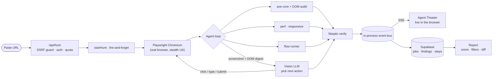

# 🪝 Snag

**Find the snags before your users do.**

Paste a URL. Snag turns loose an AI agent that opens your live web app in a real
browser and works through it like a QA engineer on their worst day — clicking,
typing, submitting, and probing — then hands back a categorized report of the
bugs and quality issues it caught, with screenshots, fix suggestions, and a
health score. You watch it think in real time.

It isn't a linter and it isn't a script of hard-coded assertions. It's a
vision-driven agent that decides what to do next from what's actually on screen,
cross-checked by deterministic accessibility, performance, and responsive audits
so the findings are real, not vibes.

> **Try it with no signup:** the launcher has demo chips pointed at real public
> apps — one free hunt, then create an account to test your own.

---

## What makes it different

Most "AI testing" tools generate a test file and stop. Snag actually *drives the
app* and reports what it finds, combining four things that rarely ship together:

- **A live agent, not a script.** A vision LLM looks at each screenshot + a DOM
  digest and picks the next action. It explores multiple pages, avoids repeating
  itself, and runs real end-to-end flows (login, sign-up, checkout) to the goal.
- **The Agent Theater.** Every thought, action, and screenshot streams to the
  browser over SSE as the hunt happens — you see *why* it clicked what it clicked.
- **A skeptic pass.** A second model reviews each candidate finding and throws
  out false alarms before they reach your report — the #1 complaint about QA bots.
- **Multi-tenant and real.** Supabase auth, per-account history, row-level
  security, daily quota. Judges sign up and paste their own URL, live.

## What it checks

A manual QA pass, automated:

| Area | What Snag looks for |
|---|---|
| **Functional** | Console errors, uncaught exceptions, 4xx/5xx requests, dead ends, broken/blocked flows |
| **Accessibility** | Full `axe-core` sweep (WCAG 2.0/2.1 A/AA + best-practice) — contrast, labels, landmarks, `lang`, ARIA |
| **Visual / UI** | Font-hierarchy & type-scale, tiny fonts, distorted or dimensionless images, mixed content |
| **Responsive** | Mobile (375) and tablet (768) — horizontal overflow, tap targets under 44px |
| **Performance** | Real Web Vitals — LCP, CLS, TTFB — each with the culprit element |
| **Forms** | Missing submit, wrong input types, structure problems |
| **Flows** | Auto-discovered + user-named journeys run end-to-end; a blocked flow is a high-severity finding |

Every finding gets a **severity**, a **category** (so the report filters by
"show only accessibility"), a **fix suggestion**, a **docs link**, and — where it
can — an **element-cropped screenshot** of the exact spot. The report carries a
**health score** and a **regression diff** against the previous run on the same URL.

## How a hunt works



The worker and the web server run in **one container**, so the live event bus is
just in-process pub/sub — no queue, no extra infra. That's also why it's hosted
on a persistent container (Hugging Face) rather than serverless.

The vision model has a **provider fallback chain** — Gemini 3 Flash →
Flash-Lite → NVIDIA NIM → Groq — that rotates automatically on rate limits, so a
free-tier 429 never kills a hunt.

## Stack (all free tier)

| Layer | Choice |
|---|---|
| App + agent | **Next.js 16** (App Router) + in-process **Playwright** worker, one Docker image |
| Hosting | **Hugging Face** Spaces (Docker, persistent container) |
| Data | **Supabase** — Auth + Postgres (RLS) + Storage |
| Vision LLM | **Gemini 3 Flash** → Flash-Lite → **NVIDIA NIM** → **Groq**, rotate on 429 |
| Audits | **axe-core**, raw Performance API, DOM heuristics |

## Run it locally

```bash
cp .env.example .env.local      # fill in Supabase + GEMINI_API_KEY
npm install
npx playwright install chromium # only needed to run a real hunt locally
npm run dev                     # http://localhost:3000
```

Run `supabase/migrations/*.sql` in the Supabase SQL editor (in order) to create
the tables, RLS policies, and the public `shots` storage bucket. Only
`GEMINI_API_KEY` is required; the NVIDIA/Groq keys are optional fallbacks.

## Security

Snag points a real browser at URLs strangers supply, so the boundaries matter:

- **SSRF guard** on every target (and every login URL): rejects localhost, private
  and link-local ranges, cloud-metadata (`169.254.169.254`), IPv4-mapped IPv6,
  numeric-encoded hosts, and resolves DNS to block rebinding.
- **Row-level security** scopes every job, finding, and step to its owner. The
  server's secret key is used only server-side and never reaches the browser.
- **Login credentials are used once, by the browser only.** When you test a site
  behind auth, the creds drive Playwright's login and are **never stored, never
  logged, and never sent to the LLM** — the model only ever sees screenshots.
- The vision model does see screenshots, so run Snag against apps whose content
  you're comfortable sending to a third-party model.

## Roadmap

PR-comment bot → auto-filed GitHub issues → root-cause + patch suggestions →
scheduled monitoring → localhost tunnel → MCP server for coding agents → teams.

---

<sub>Built solo, from scratch, for the OpenAI × NamasteDev hackathon. ₹0 to run.</sub>
