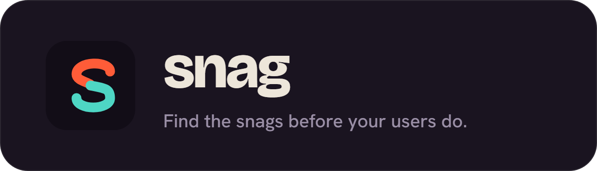
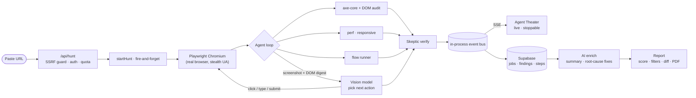

<p align="center">
  
</p>

<p align="center">
  
  
  
  
</p>

---

Paste a URL. Snag sends an AI agent into your live web app, opens it in a real
browser, and works through it the way a QA engineer would on a bad day: clicking,
typing, submitting, and poking at anything that looks fragile. When it finds
something, you get a categorized report with screenshots, fix suggestions, and a
health score. And you watch the whole thing happen, live.

It is not a linter, and it is not a script of hard-coded assertions. It is a
vision-driven agent that decides what to do next from what is actually on the
screen, backed by deterministic accessibility, performance, and responsive
audits so the findings hold up.

> **Want to see it first?** Watch a real recorded run replay instantly on the
> demo page — no signup. Or run one free hunt yourself against a public app, then
> create an account to test your own.

## What makes it different

Most "AI testing" tools generate a test file and stop. Snag actually drives the
app and reports what it finds. Five things it puts together that rarely ship in
one product:

- **A live agent, not a script.** A vision model looks at each screenshot plus a
  DOM digest and picks the next move. It explores across pages, avoids repeating
  itself, and runs real end-to-end journeys like login, sign-up, and checkout.
- **The Agent Theater.** Every thought, action, and screenshot streams to your
  browser as the hunt happens, so you can see why it clicked what it clicked — and
  you can stop the hunt at any time.
- **A skeptic pass.** A second model reviews each candidate finding and throws
  out the false alarms before they reach your report. That is the number one
  complaint about QA bots, handled.
- **An AI-written report.** When the hunt finishes, the model writes a plain-
  English summary of the run and generates a concrete root-cause fix for the worst
  findings — not just a link to a rule.
- **Multi-tenant and real.** Supabase auth, per-account history, row-level
  security, and a daily quota. Every account is fully isolated.

## What it checks

A manual QA pass, automated:

| Area | What Snag looks for |
|---|---|
| **Functional** | Console errors, uncaught exceptions, 4xx and 5xx requests, dead ends, broken or blocked flows |
| **Accessibility** | A full `axe-core` sweep (WCAG 2.0 and 2.1, A and AA, plus best-practice), covering contrast, labels, landmarks, `lang`, and ARIA |
| **Visual and UI** | Font hierarchy and type scale, tiny fonts, distorted or dimensionless images, mixed content |
| **Responsive** | Mobile (375) and tablet (768): horizontal overflow and tap targets under 44px |
| **Performance** | Real Web Vitals (LCP, CLS, TTFB), each with the element that caused it |
| **Forms** | Missing submit, wrong input types, structural problems |
| **Flows** | Journeys it discovers on its own, plus ones you name, run end-to-end. A blocked flow is a high-severity finding |

Every finding gets a severity, a category (so the report filters down to, say,
just accessibility), a fix suggestion, a docs link, and where it can, a cropped
screenshot of the exact spot.

## The report you get

Snag's report is built to hand straight to a developer:

- **A plain-English summary** the model writes about the run: the overall state,
  the weakest area, and the single most important thing to fix first.
- **Concrete root-cause fixes** for the most serious findings, with a code snippet
  where it helps.
- **Grouped and filterable** by category and severity, with a health score (A–F)
  and a regression diff against the previous run on the same URL.
- **Take it anywhere:** copy any finding as a GitHub issue, export the whole
  report as Markdown, or download a print-ready PDF.

## How a hunt works



The worker and the web server run in one container, so the live event bus is just
in-process pub/sub, with no queue and no extra infrastructure to stand up. That
is also why it runs on a persistent container (Hugging Face) rather than on
serverless functions.

The vision model has a fallback chain (Gemini 3 Flash, then Flash-Lite, then
NVIDIA NIM, then Groq) that rotates automatically on rate limits, so one provider
throttling a request never kills a hunt.

## Stack

| Layer | Choice |
|---|---|
| App and agent | **Next.js 16** (App Router) with an in-process **Playwright** worker, one Docker image |
| Hosting | **Hugging Face** Spaces (Docker, persistent container) |
| Data | **Supabase**: Auth, Postgres with RLS, and Storage |
| Vision model | **Gemini 3 Flash**, then Flash-Lite, then **NVIDIA NIM**, then **Groq**, rotating on 429 |
| Audits | **axe-core**, the raw Performance API, and DOM heuristics |

## Run it locally

```bash
cp .env.example .env.local      # fill in Supabase and GEMINI_API_KEY
npm install
npx playwright install chromium # only needed to run a real hunt locally
npm run dev                     # http://localhost:3000
```

Run the SQL in `supabase/migrations` in order (in the Supabase SQL editor) to
create the tables, RLS policies, and the private `shots` storage bucket. Only
`GEMINI_API_KEY` is required. The NVIDIA and Groq keys are optional fallbacks.

## Security

Snag points a real browser at URLs that strangers supply, so the boundaries
matter:

- **Every request the browser makes is checked, not just the URL you paste.** A
  network-layer guard blocks localhost, private and link-local ranges, cloud
  metadata (`169.254.169.254`), IPv4-mapped IPv6, and numeric-encoded hosts, and
  it resolves hostnames so a name that points at a private address is rejected
  too. The guard re-applies after redirects and after any navigation the agent
  makes.
- **Screenshots stay private.** A hunt behind your own login can capture your
  app's data, so screenshots live in a private bucket and are served only through
  short-lived signed URLs. Nothing is world-readable.
- **Every row is scoped to its owner.** Row-level security covers jobs, findings,
  and steps. The secret key runs only on the server and never reaches the browser.
- **Login details are used once, by the browser only.** When you test a site
  behind auth, the credentials drive Playwright's login and are never stored,
  never logged, and never sent to the AI. The model only ever sees screenshots.
- The vision model does see those screenshots, so point Snag at apps whose
  content you are comfortable sending to a third-party model.

## Roadmap

A PR-comment bot, then auto-filed GitHub issues, then root-cause and patch
suggestions, then scheduled monitoring, a localhost tunnel, an MCP server for
coding agents, and teams.
